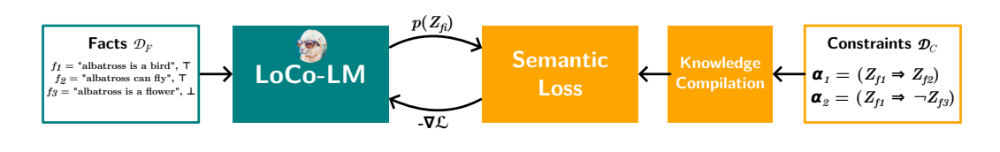

# [Logically Consistent Language Models via Neuro-Symbolic Integration](https://arxiv.org/abs/2409.13724)
[](https://arxiv.org/abs/2409.13724)


**Authors**: Diego Calanzone, Stefano Teso, Antonio Vergari. <br>
**Affiliation**: DISI University of Trento, University of Edinburgh.

**Abstract**: Large language models (LLMs) are a promising venue for natural language understanding and generation. However, current LLMs are far from reliable: they are prone to generating non-factual information and, more crucially, to contradicting themselves when prompted to reason about relations between entities of the world. These problems are currently addressed with large scale fine-tuning or by delegating reasoning to external tools. In this work, we strive for a middle ground and introduce a loss based on neuro-symbolic reasoning that teaches an LLM to be logically consistent with an external set of facts and rules and improves self-consistency even when the LLM is fine-tuned on a limited set of facts. Our approach also allows to easily combine multiple logical constraints at once in a principled way, delivering LLMs that are more consistent w.r.t. all constraints and improve over several baselines w.r.t. a given constraint. Moreover, our method allows LLMs to extrapolate to unseen but semantically similar factual knowledge, represented in unseen datasets, more systematically.



## Installation
You will need to have [miniconda](https://docs.anaconda.com/miniconda/install/) installed. <br>
To get started, you can launch the setup script:
```
    bash scripts/setup.sh
```
It will do for you:
- creation of the directories necessary to run the experiments
- installation of the project environment (contained in `environment.yml`)
- download of the datasets: beliefbank, conceptnet, entailmentbank

The repo follows the structure:
```
    - assets/       # visualization
    - configs/      # fine-tuning, eval config files (multiple models)
    - data/         # raw json datasets
    - datasets/     # data classes
    - checkpoints/  # network weights
    - models/       # loco-lm implementation and training classes
    - utils/        # auxiliary scripts for eval/training
```

## Getting started
To fine-tune e.g. `llama-3.1`, you can run:
```
python run.py --config configs/train_llama.json --constraint_type all --run_name super-loco-llama-3.1-8b
```
Where `constraint_type` allows you to choose logical constraints among the ones considered in our experimental setup: `"implication", "inverse_implication", "negation", "all"`. Running the training script will implicate logging to wandb by default. 

You can manage training hyperparameters and models in config files formatted as in `configs/train_llama.json`. By default, the training dataset is `beliefbank`.

Currently tested and supported models are `Llama, Macaw, T5, Mistral`.

### Evaluation on BeliefBank
After completing the training phase, you can evaluate a `loco-lm` by passing the appropriate config file, formatted as in `configs/eval_llama.json`:
```
python run.py --config configs/eval_llama3.json --constraint_type all --run_name eval-super-loco-llama-3.1-8b
```
Particularly, the config file must include the `checkpoint` attribute to load a local fine-tuned version. By default, checkpoint are saved in `.pth` format.


### Evaluation on alternative datasets
Similarly to the previous section, you can run additional evaluations on e.g. `entailmentbank, conceptnet` by running e.g.
```
python scripts/experiments/eval_entailmentbank.py
```
For ConceptNet, you will first need to extract a defined domain subset with the script in `scripts/get_conceptnet.py` or alternatively by using our pre-defined splits in `data/conceptnet`. 

The refactored implementation of ConceptNet is yet to be released.

## License
This model is under the [MIT license](LICENSE).

## Contributing
Feel free to open a pull request to fix any bug/improve any step of the pipeline.

## Citing LoCo-LMs
```
@misc{calanzone2024logicallyconsistentlanguagemodels,
      title={Logically Consistent Language Models via Neuro-Symbolic Integration}, 
      author={Diego Calanzone and Stefano Teso and Antonio Vergari},
      year={2024},
      eprint={2409.13724},
      archivePrefix={arXiv},
      primaryClass={cs.CL},
      url={https://arxiv.org/abs/2409.13724}, 
}
```

